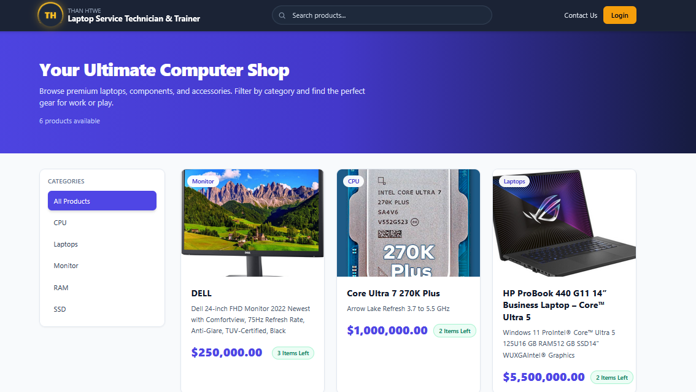
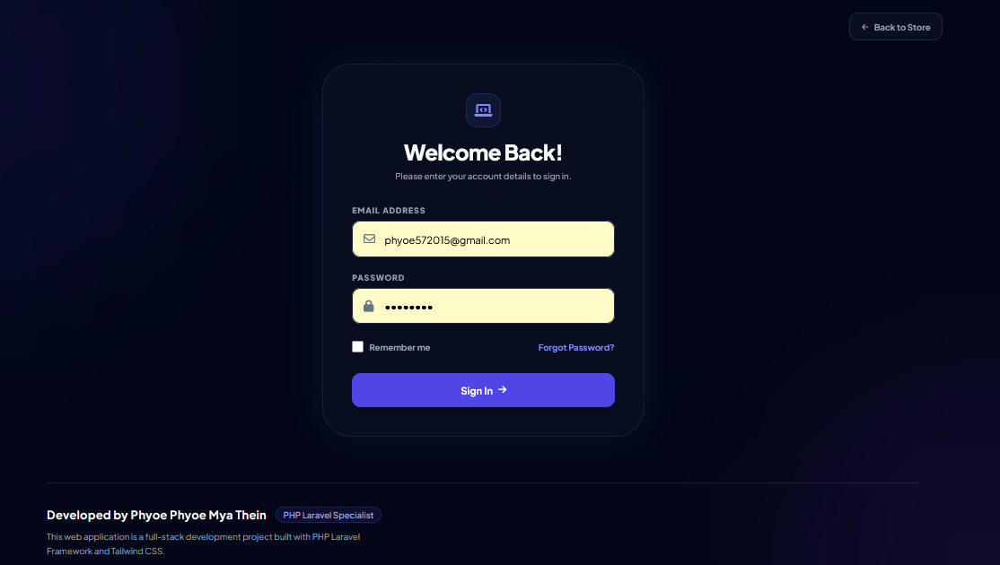
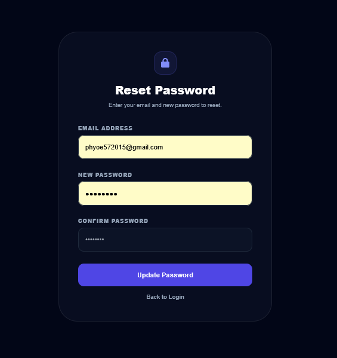
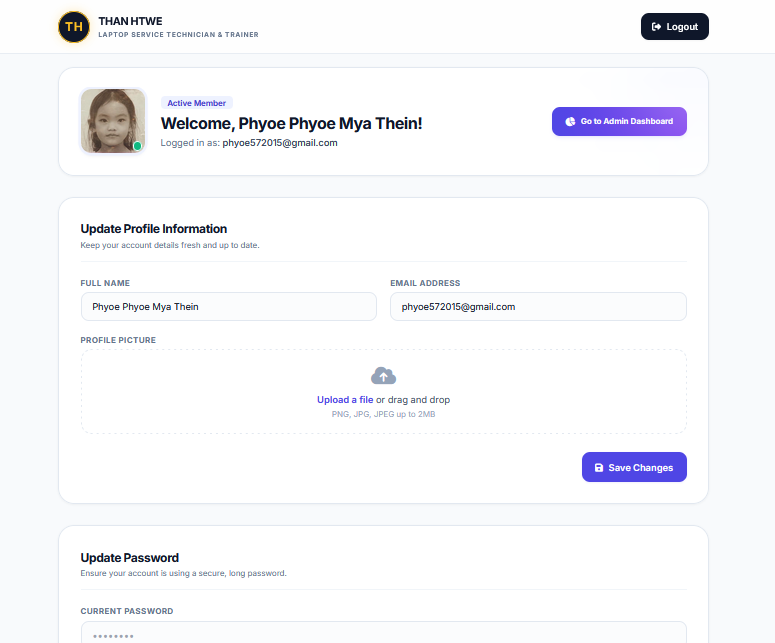
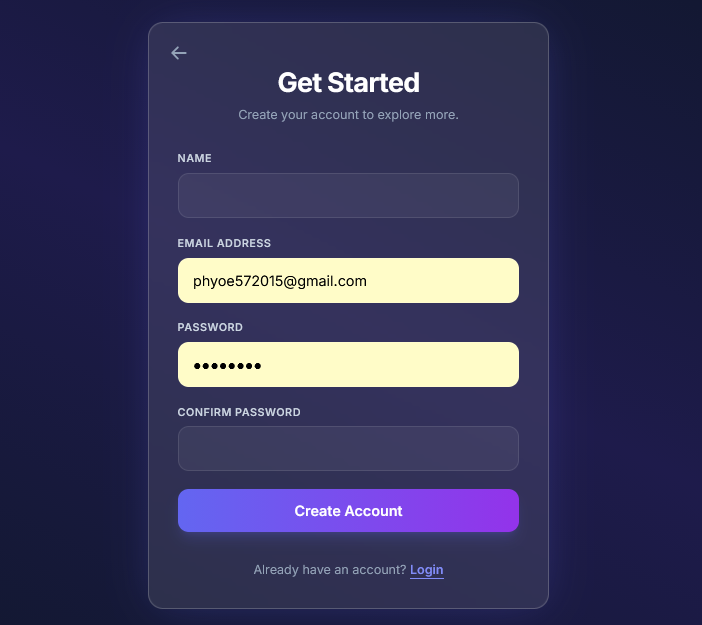
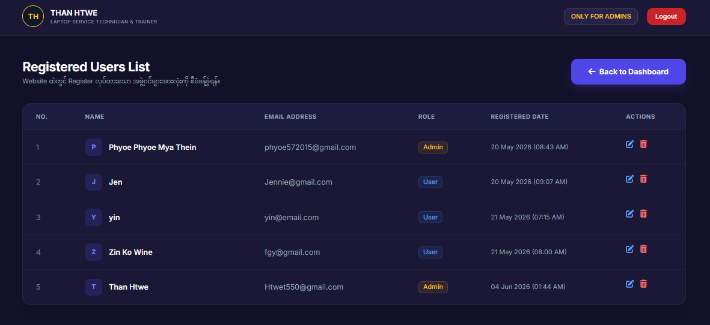
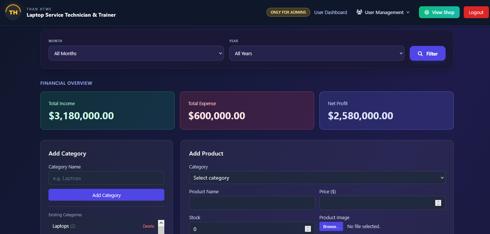

# Laptop Service & Computer Shop System

This is a Full-Stack Web Application built with Laravel and Tailwind CSS, designed to manage laptop service operations and provide a seamless shopping experience for computer components.

## 🚀 Key Features

* **Role-Based Access:** Secure access control for Admin and User roles.
* **User Management:** Efficiently manage and organize user accounts.
* **Product Catalog:** Browse and filter products by categories (CPU, Laptops, Monitors, etc.).
* **Modern UI:** Responsive and user-friendly interface powered by Tailwind CSS.

## 🛠 Technologies Used

* **Backend:** PHP (Laravel Framework)
* **Frontend:** Tailwind CSS, Blade Templates
* **Database:** MySQL
* **Version Control:** Git & GitHub

## 📋 Installation

To run this project on your local machine, follow these steps:

```bash
git clone [https://github.com/Phyoephyoemyathein/my-project.git](https://github.com/Phyoephyoemyathein/my-project.git)
composer install
cp .env.example .env
php artisan key:generate
php artisan migrate
php artisan serve
```

## 🗄️ Database Setup

To set up the database for this project, follow these steps:

1. **Create Database:**
   Create a new MySQL database in your local environment (e.g., using phpMyAdmin or MySQL Workbench) named `my_project_db` (or any name you prefer).

2. **Configure Environment:**
   Locate the `.env` file in your project root folder. If it does not exist, rename `.env.example` to `.env`. Open it and update the database connection details:

   ```env
   DB_CONNECTION=mysql
   DB_HOST=127.0.0.1
   DB_PORT=3306
   DB_DATABASE=your_database_name
   DB_USERNAME=your_database_username
   DB_PASSWORD=your_database_password
3.  **Run Migrations:**
Open your terminal in the project directory and run the following command to create the necessary tables in your database:
```bash
php artisan migrate
```

## 🤝 Contact
If you have any questions, suggestions, or would like to collaborate, feel free to reach out to me!

GitHub: Phyoephyoemyathein

Email: phyoe572015@gmail.com

LinkedIn:[ linkedin.com/in/phyophyomyathein96](https://www.linkedin.com/in/phyophyomyathein96/)

## 📸 Project Screenshots









---
*Developed by Phyoe Phyo Mya Thein*
